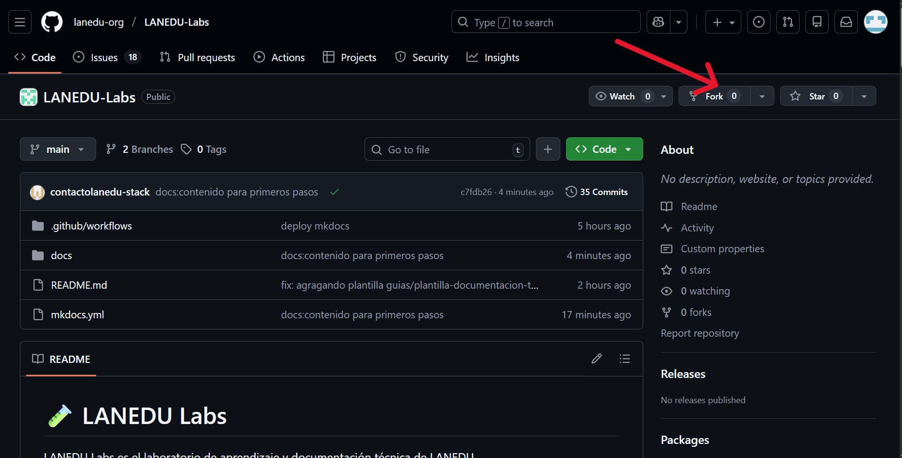

# GitHub desde cero – Flujo técnico completo

Este documento explica **paso a paso** cómo trabajar en LANEDU Labs
usando un flujo técnico real:

Fork → Codespaces → Git → Commit → Push → Pull Request

Al terminar esta guía, podrás **contribuir como en un proyecto profesional**.

---

## 🎯 Objetivo técnico

Al finalizar este documento sabrás:

- Forkear un repositorio
- Abrir un Codespace
- Trabajar con Git desde la terminal
- Crear commits correctamente
- Enviar cambios a GitHub
- Abrir un Pull Request

---

## 🧭 Paso 0: Requisitos mínimos

Necesitas:

- Una cuenta en GitHub
- Navegador web
- (Opcional) Conocimientos básicos de terminal

No necesitas instalar nada localmente.

---

## 🍴 Paso 1: Fork del repositorio

1. Ve al repositorio oficial:
```
https://github.com/lanedu-org/LANEDU-Labs
```

2. Haz clic en **Fork** (arriba a la derecha)
3. Crea el fork en tu cuenta personal

🎯 Resultado:
- Ahora tienes tu propia copia del repositorio




---

## 💻 Paso 2: Abrir el proyecto en Codespaces

1. En tu fork, haz clic en **Code**
2. Ve a la pestaña **Codespaces**
3. Haz clic en **Create codespace on main**

GitHub abrirá un entorno de desarrollo en el navegador.

🎯 Resultado:
- VS Code web
- Terminal integrada
- Repositorio clonado automáticamente

📸 *[Imagen sugerida: creación de Codespace]*

---

## 📁 Paso 3: Explorar el proyecto

En la terminal del Codespace, ejecuta:

```bash
ls
```

Verás carpetas como:
```
docs/
mkdocs.yml
README.md
```

Explora la documentación:

```bash
cd docs
ls
```

📸 *[Imagen sugerida: estructura del proyecto en VS Code]*

---

## 🌿 Paso 4: Crear una rama de trabajo

Nunca trabajes directamente en main.

Crea una nueva rama:

```bash
git checkout -b docs/add-glossary-term
```

Verifica la rama actual:

```bash
git branch
```

🎯 Resultado:
- Estás trabajando en una rama nueva

---

## ✏️ Paso 5: Editar un archivo

Abre el glosario:

```bash
code onboarding/glossary.md
```

Agrega un término nuevo siguiendo el formato existente:

```markdown
- **Fork:** copia de un repositorio para trabajar de forma independiente
```

Guarda el archivo.

📸 *[Imagen sugerida: edición del archivo en VS Code]*

---

## 💾 Paso 6: Revisar cambios

Mira qué cambió:

```bash
git status
```

Ver diferencias:

```bash
git diff
```

---

## 🧾 Paso 7: Crear un commit

Agrega el archivo al staging:

```bash
git add docs/onboarding/glossary.md
```

Crea el commit:

```bash
git commit -m "Add Fork definition to glossary"
```

🎯 Buenas prácticas:
- Mensajes claros
- Un commit = un cambio

---

## 🚀 Paso 8: Enviar cambios a GitHub

Sube tu rama al repositorio:

```bash
git push origin docs/add-glossary-term
```

🎯 Resultado:
- Tu rama queda disponible en GitHub

---

## 🔁 Paso 9: Abrir el Pull Request

Ve a tu repositorio en GitHub

Verás un aviso para crear el PR

Haz clic en Compare & pull request

📸 *[Imagen sugerida: botón Compare & pull request]*

---

## 📝 Paso 10: Completar el Pull Request

Usa esta estructura:

```
¿Qué cambia este PR?
- Agrega definición de Fork al glosario

¿Por qué es necesario?
- El término se usa frecuentemente y no estaba definido

Issue relacionada:
- #<número de la Issue>
```

Crea el Pull Request.

---

## 🎉 ¡Primer aporte completado!

Acabas de realizar un flujo técnico completo:

- Fork
- Codespaces
- Git
- Commit
- Push
- Pull Request

Este es el mismo flujo que se usa en proyectos reales.

---

## 🧠 Qué hacer ahora

Desde aquí puedes:

- Tomar otra Issue
- Trabajar en documentación más compleja
- Explorar tecnologías (Python, Docker, Git, etc.)

---

## 🔑 Regla final

No importa si sabes poco o mucho.
Importa que sigas el flujo correcto.